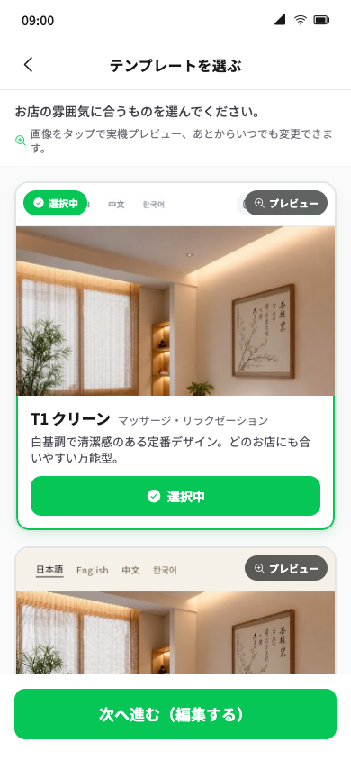
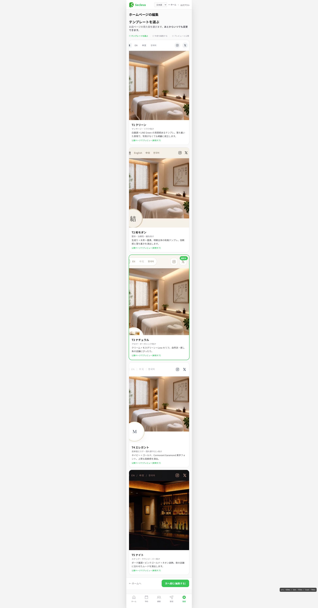
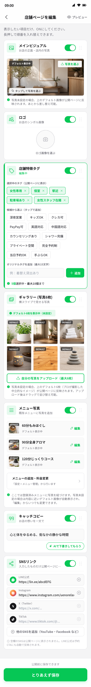
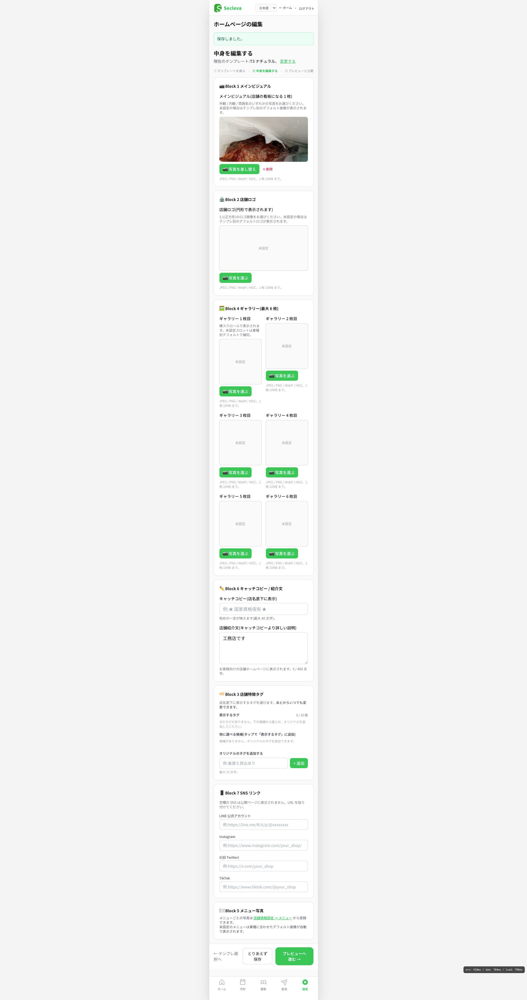
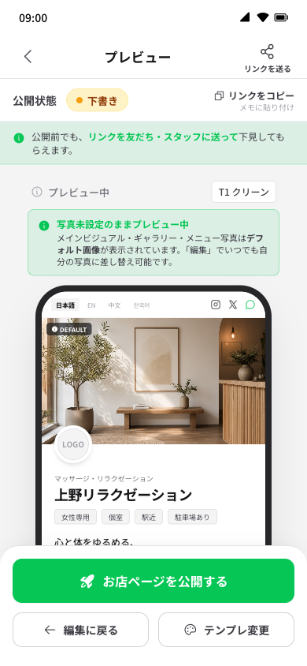
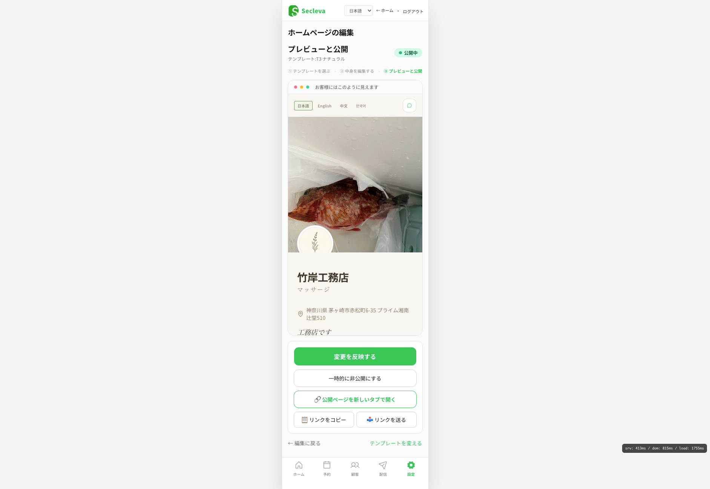
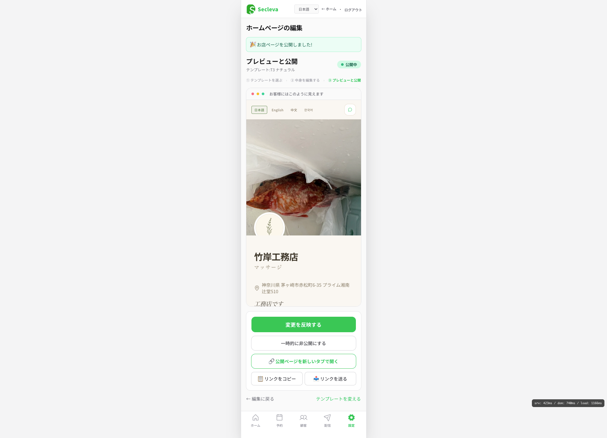

# 店舗ページ編集機能 モック ↔ 本番 差分レポート

**作成日**：2026-05-12
**対象URL**：`secleva.com/owner/settings/shop-lp` (step=template / edit / preview)
**モック参照**：
- リポジトリ：https://github.com/you2take/secleva-design-mockups
- デプロイ：https://secleva.vercel.app/shop-page/admin/02_block-edit.html
- 仕様書：[admin/README.md](https://github.com/you2take/secleva-design-mockups/blob/main/shop-page/admin/README.md)

---

## 0. 全体所感

本番実装は **「モックを参考に別実装で書き直されている」状態**。骨格は近いが、以下の3点で UX が大きく欠落している。

1. **クロップモーダル（X風 写真トリミング）** が動いていない
2. **タグの候補プリセット**（12種）が空っぽ
3. **メニュー写真エリア** が実質未実装

加えて、ブロック順序や「店舗紹介文」フィールド追加など、**モックと異なる仕様判断** がいくつか入っている。

---

## 1. 修正項目（優先順位順）

凡例：🔴 最優先（UX破綻） / 🟡 仕様逸脱 / 🟢 装飾欠落

### 🔴 P0-1: クロップモーダルが動いていない

| | 内容 |
|---|---|
| 現状 | 写真をアップロードしても **トリミングなしでそのまま表示**。プレビューでヒーロー画像（魚の写真）が画面内で見切れている |
| あるべき | 写真選択 → **フルスクリーン黒背景モーダル** → ドラッグ＆ピンチで見える範囲を選択 → 確定で反映（X / Twitter のUI参照） |
| モック実装 | [02_block-edit.html#crop-modal](https://github.com/you2take/secleva-design-mockups/blob/main/shop-page/admin/02_block-edit.html) — `Cropper.js` 1.6.2（CDN）を採用 |
| 影響範囲 | Block 1（16:9）/ Block 2（1:1）/ Block 4（1:1）/ Block 5（5:3） すべて |
| 実装ヒント | 各アップロードボタンに `data-upload-trigger / data-target / data-aspect` 属性を付与し、共通の `#upload-input`（hidden file input）と `#crop-modal` を1個ずつ用意。詳細は README §「ステップ2：X風 クロップモーダル」 |

### 🔴 P0-2: タグの候補プリセット（12種）が空っぽ

| | 内容 |
|---|---|
| 現状 | 「他に選べる候補」が空。オリジナル追加でしか入れられない |
| あるべき | 12種のプリセット候補が初期表示（タップで選択中へ昇格／× で候補削除） |
| プリセット内容 | 深夜営業 / キッズOK / クレカ可 / PayPay可 / 英語対応 / 中国語対応 / カウンセリングあり / シャワー完備 / プライベート空間 / 完全予約制 / 当日予約OK / 手ぶらOK |
| モック実装 | [02_block-edit.html L245-296](https://github.com/you2take/secleva-design-mockups/blob/main/shop-page/admin/02_block-edit.html) |
| 補足 | 業種別のマスター候補を出し分ける設計も視野（README §「タグ操作仕様」参照） |

### 🔴 P0-3: メニュー写真エリアが未実装

| | 内容 |
|---|---|
| 現状 | 「メニューから登録できます」というガイド文だけ |
| あるべき | 登録済みメニュー1件ずつにアコーディオン展開行があり、写真の差し替え／デフォルト4枚から選択／削除ができる |
| 構造 | 1メニュー＝1行（サムネ＋名前＋編集ボタン） → タップで展開パネル（5:3プレビュー＋アップロード＋デフォ4枚＋削除/保存） |
| モック実装 | [02_block-edit.html Block 5 (L460+)](https://github.com/you2take/secleva-design-mockups/blob/main/shop-page/admin/02_block-edit.html) |
| 注意 | メニューの **追加・料金変更** は別画面 `settings/menus` の責務。Block 5 は **写真のひも付けのみ** |

### 🟡 P1-1: ブロック順序が違う

| | 現状の順序 | あるべき順序（モック） |
|---|---|---|
| 1 | メインビジュアル | メインビジュアル |
| 2 | ロゴ | ロゴ |
| 3 | ギャラリー | **店舗特徴タグ** |
| 4 | キャッチコピー＋紹介文 | ギャラリー |
| 5 | 店舗特徴タグ | メニュー写真 |
| 6 | SNS | キャッチコピー |
| 7 | メニュー写真 | SNS |

**理由**：店名直下に出るタグはユーザーの離脱判断に直結するため、ロゴ直後（上位）に置くのがモックの設計判断。ギャラリーやキャッチは詳細閲覧フェーズ。

### 🟡 P1-2: 「店舗紹介文」フィールドが追加されている

| | 内容 |
|---|---|
| 現状 | キャッチコピー（短文）＋店舗紹介文（400文字長文）の **2フィールド** |
| モック | キャッチコピー1個のみ（〜40文字） |
| 議論ポイント | 「店舗紹介文」を追加するか、それともキャッチ1個でいくか。**仕様判断が必要**（友人エンジニア判断 or Yuto指示） |
| 仮提案 | キャッチ1個に戻す or 「紹介文（任意）」として後置（公開ページの所在地下に出る） |

### 🟡 P1-3: ブロック ON/OFF トグル & 並べ替えハンドルが全削除されている

| | 内容 |
|---|---|
| 現状 | 各ブロックヘッダに ON/OFF / ハンドル無し |
| あるべき | 各ブロック右上に LINE緑トグル（OFFで公開ページから該当セクション省略）と6点ドラッグハンドル |
| モック仕様 | バックエンドは `blocks.{name}.visible: bool` で保持。OFFでも入力データは消えない。詳細は README §「ブロック表示トグル」 |

### 🟡 P1-4: ギャラリーUIが2列スロット化されている

| | 内容 |
|---|---|
| 現状 | 「ギャラリー1枚目〜6枚目」の名前付きスロットを2列で並べ、各スロットに個別「写真を選ぶ」 |
| あるべき | 6枚サムネ（3列×2行）＋大プレビュー編集エリア（選択中枚を編集できる方式） |
| 利点 | スマホ画面で縦が圧迫されない／編集中の枚が明確／クロップフローと馴染む |
| モック実装 | [02_block-edit.html Block 4](https://github.com/you2take/secleva-design-mockups/blob/main/shop-page/admin/02_block-edit.html) |

### 🟢 P2-1: SNS リンクのアイコン装飾が消えている

| | 内容 |
|---|---|
| 現状 | プレーンな input フィールドのみ |
| あるべき | 各 SNS にアイコン丸が付く：LINE緑丸 / Instagram グラデ / X黒 / TikTok黒 |
| モック実装 | [02_block-edit.html Block 7](https://github.com/you2take/secleva-design-mockups/blob/main/shop-page/admin/02_block-edit.html) |

### 🟢 P2-2: キャッチコピーの「AIで下書きしてもらう」ボタンが無い

| | 内容 |
|---|---|
| 現状 | 入力欄のみ |
| あるべき | 入力欄下に「✨ AIで下書きしてもらう」ボタン（モック実装済み、本番は API 連携が必要） |
| 優先度 | 任意機能なので後回しでも可。ただしリテラシー低層オーナーに有用 |

### 🟢 P2-3: タグ追加・削除アニメーションが無い

| | 内容 |
|---|---|
| 現状 | 即時 DOM 変更 |
| あるべき | CSS keyframes：追加時 `tagIn`（スケール＋オーバーシュート）、削除時 `tagOut`（max-width/padding 連動畳み）、カウンタ更新 `counterBounce` |
| モック実装 | [02_block-edit.html style](https://github.com/you2take/secleva-design-mockups/blob/main/shop-page/admin/02_block-edit.html) |

### 🟢 P2-4: ブロック編集中の border-2 緑枠強調が無い

| | 内容 |
|---|---|
| 現状 | 全ブロック同じ枠 |
| あるべき | 編集中のブロックだけ `border-2 border-line` で強調 ＆ サブラベル「編集中」表示 |

---

## 2. 画面別 比較

### 画面1: テンプレート選択（?step=template）

<table>
<tr><th>モック</th><th>本番</th></tr>
<tr>
<td valign="top" width="50%"></td>
<td valign="top" width="50%"></td>
</tr>
</table>

**この画面は概ね OK**。5テンプレ並び・サムネ・「公開ページをプレビュー」リンクすべて実装されている。
**気になる差分**：
- 「次へ進む（編集する）」ボタンの位置・サイズはモックほぼ通り
- T3 が緑border強調されており、現在選択中のUXは伝わる
- ヘッダの「3ステップ表示」（テンプレ／編集／プレビュー）はモック設計通り

### 画面2: 中身を編集（?step=edit）

<table>
<tr><th>モック（最新仕様）</th><th>本番</th></tr>
<tr>
<td valign="top" width="50%"></td>
<td valign="top" width="50%"></td>
</tr>
</table>

**最重要画面**。P0/P1 のほぼ全てがこの画面で発生。

特に **本番側で目に見える問題**：
- メインビジュアルに**魚の写真が無加工で貼り付け**（クロップモーダル未動作）
- ロゴ・ギャラリーが「未設定」破線枠で、写真選択しても**そのまま貼り付くだけ**
- ギャラリーが **6枚別々のスロット**になっており、編集中の枚が分かりづらい
- 「店舗紹介文」フィールド（モックに無い）が追加されている
- Block 3 タグ：候補が空っぽ、初期12種プリセットが消えている
- Block 5 メニュー写真：ガイド文だけで実装無し
- 全ブロックに **ON/OFFトグルと並べ替えハンドルが無い**
- ブロック順序：1→2→**4→6→3→7→5** に並び替わっている

### 画面3: プレビューと公開（?step=preview）

<table>
<tr><th>モック</th><th>本番</th></tr>
<tr>
<td valign="top" width="50%"></td>
<td valign="top" width="50%"></td>
</tr>
</table>

**この画面も概ね OK**。状態badge、4種CTA、トースト「公開しました」もある。
**注意**：プレビュー枠内のヒーロー画像（魚の写真）がクロップ未適用で見切れている → **P0-1 の証拠**。

公開後の状態（「お店ページを公開しました!」バナー表示）：

---

## 3. 進め方の提案

### A. 推奨：GitHub Issue 化して段階リリース

このレポートを GitHub Issues に転記（Issue 1個 = 修正項目1個）。優先度ラベルで管理：
- **Sprint 1**：P0-1, P0-2, P0-3（UX破綻 3点）
- **Sprint 2**：P1-1, P1-2, P1-3, P1-4（仕様統一）
- **Sprint 3**：P2-1〜P2-4（装飾・体験向上）

### B. 補足資料

- 各項目の **実装ヒント** には GitHub のモック該当行リンクを貼っている → 友人エンジニアはそのままコピペ可
- **README.md** に全機能仕様を網羅（バックエンドデータ形式まで記載）
- 不明点があれば該当 Issue 上で質問してもらう運用がよい

### C. 仕様判断が必要な項目

以下は Yuto の判断が必要：
- **P1-2** 「店舗紹介文」フィールドを残すか撤去するか
- **P1-1** ブロック順序を厳密にモック通りにするか、現状のままにするか
- **P2-2** AI下書きボタンを v1 でリリースするか v2 に回すか

---

## 4. 関連リンク

- **モックリポジトリ**：https://github.com/you2take/secleva-design-mockups
- **モック admin デプロイ**：
  - https://secleva.vercel.app/shop-page/admin/01_template-select.html
  - https://secleva.vercel.app/shop-page/admin/02_block-edit.html
  - https://secleva.vercel.app/shop-page/admin/03_preview.html
- **仕様書**：[shop-page/admin/README.md](https://github.com/you2take/secleva-design-mockups/blob/main/shop-page/admin/README.md)
- **本番**：`secleva.com/owner/settings/shop-lp?step=template|edit|preview`

---

## 補足：このレポートのスクショ一覧

`handoff/screenshots/` 配下に以下が格納されている。GitHub 上でも該当画像のURLを直リンク可能。

| ファイル | 内容 |
|---|---|
| `mock_01_template.png` | モック：テンプレ選択画面 |
| `mock_02_edit.png` | モック：編集画面（旧キャプチャ、参考） |
| `mock_02_tags.png` | モック：Block 3 タグ操作（候補プリセット表示状態） |
| `mock_02_menu.png` | モック：Block 5 メニュー写真モーダル展開状態 |
| `mock_03_preview.png` | モック：プレビュー画面 |
| `prod_01_template.png` | 本番：テンプレ選択（2026-05-12 取得） |
| `prod_02_edit.png` | 本番：編集画面 |
| `prod_03_preview.png` | 本番：プレビュー（変更を反映するボタン状態） |
| `prod_03_preview_published.png` | 本番：プレビュー（公開直後トースト表示状態） |

**最新仕様のモック実機確認**は https://secleva.vercel.app/shop-page/admin/02_block-edit.html を実機で開いて操作するのが最速（クロップモーダル等は動作する）。
